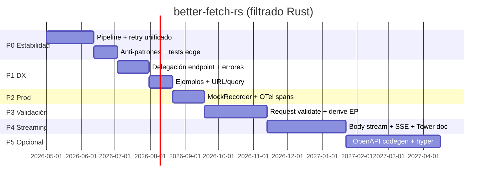

# Roadmap — better-fetch-rs

Documento de referencia interna: prioridades filtradas para Rust (sin paridad ciega con el upstream TypeScript [@better-fetch/fetch](https://better-fetch.vercel.app/docs)).

**Última actualización:** 2026-05-27  
**Versión actual del crate:** 0.4.0  
**Upstream de referencia:** `reference/upstream-src/` (gitignored)

---

## Criterios de filtrado

### Qué **no** perseguimos (TS-only o convenciones TypeScript)

| Idea upstream / informe | Motivo para no implementar (o solo documentar) |
|-------------------------|-----------------------------------------------|
| API `{ data, error }` por defecto | En Rust: `Result`, `Response` en no-throw, `throw_on_error` para `?` |
| `createSchema` + Zod / Valibot / ArkType | Ecosistema TS; equivalente Rust: `Endpoint`, macros, `garde`, OpenAPI export |
| `defaultOutput` / `defaultError` globales | Inferencia solo en tipos TS; equivalente: `Endpoint::Response` |
| `errorSchema` en runtime | Documentado en tipos TS; **no implementado** en `fetch.ts` upstream |
| Plugin `schema` con `prefix` / `baseURL` 1:1 | Multi-API en TS; en Rust: varios `Client` o `SchemaRegistry` + OpenAPI |
| `catchAllError` idéntico | Semántica “nunca throw”; en Rust: `Result` + variantes estructuradas |
| Auto `blob` / `File` / `detectResponseType` estilo browser | Explícito: `into_json`, `into_text`, bytes/stream |
| POST inferido si hay `body` (`getMethod`) | Método explícito en builder (idiomático Rust) |
| `Date` → ISO automático en JSON body | Nice-to-have bajo; usar serde + tipos propios |
| Retry en **cualquier** 4xx/5xx por defecto | Menos seguro en prod; lista acotada + `should_retry` |
| Paquete `@better-fetch/logger` separado | `LoggerPlugin` + `tracing` en el mismo crate |
| Replicar bugs upstream (p. ej. `getBody` + `headers` undefined) | No aplica |

### Qué **sí** perseguimos

- Paridad de **comportamiento** cuando aporta seguridad u operación (hooks, retry, URL, auth).
- Refactors internos (pipeline, retry unificado).
- DX idiomática Rust (typestate, macros, `trybuild`, errores tipados).
- Gaps reales: streaming masivo, tests de edge HTTP, observabilidad.
- Ventajas ya presentes en Rust: Tower, OpenAPI export, `TransportKind`, cancelación, streaming con límites.

---

## Qué ya tenemos (no “arreglar” hacia TS)

| Área | Estado |
|------|--------|
| `Result` + `throw_on_error` | Implementado |
| `Endpoint` + `NeedsParams` / `Ready` + compile-fail | Implementado (0.3) |
| Retry transporte + `Retry-After` + jitter | Implementado |
| `send_stream` + `max_response_bytes` + cancel mid-stream | Implementado (0.3) |
| OpenAPI export, Tower (path buffered) | Features `openapi`, `tower` |
| `TransportKind`, `max_in_flight` | Implementado |
| `HttpBackend` inyectable, wiremock, CI estricto | Tests + `ClientBuilder::backend` |
| Auth Bearer/Basic/Custom + async token | `auth.rs` |
| Modificadores `@get` / `@put` en path | `url_build.rs` |
| Logger | `LoggerPlugin` (tracing), no crate aparte |

---

## Bloques de trabajo

### P0 — Estabilidad y confianza (**entregado en 0.4.0**)

**Objetivo:** menos bugs silenciosos; misma semántica en `send` y `send_stream`.

#### Refactors internos (code quality)

| ID | Cambio | Detalle | Esfuerzo |
|----|--------|---------|----------|
| R1 | `prepare_request()` compartido | URL, schema strict, auth, plugins, `on_request`, semáforo, retry policy — una vez para `execute` y `execute_stream` | M |
| R2 | Motor de retry unificado | Parametrizar buffered vs stream (+ peek); alinear `throw_on_error` + body en errores HTTP | L |
| R3 | Colapsar ramas retry en streaming | Stub + `on_retry` + `sleep_or_cancel` sin duplicar | S |
| R4 | `retry_context_response()` | Factory para stubs de retry / transport | S |
| R5 | `http_error_for_status(status, body)` | No duplicar `canonical_reason()` en message y status_text | S |
| R6 | `parse_request_header()` compartido | `request.rs` + `ClientBuilder`; variantes `InvalidHeader` en vez de `Error::Other` | S |
| R7 | `accumulate_stream()` | Unificar `collect` y `drain_body_for_retry` + `BodyTooLarge` | M |
| R8 | Partir `client.rs` | `client.rs` (API), `client_builder.rs`, `request_pipeline.rs` | L |

**Archivos principales:** `crates/better-fetch/src/client.rs`, `streaming.rs`, `request.rs`, `response.rs`, `error.rs`.

#### Anti-patrones (arreglar sí o sí)

| ID | Problema | Fix |
|----|----------|-----|
| A1 | `apply_serialized_query` ignora errores serde (`endpoint.rs`) | Devolver `Result` o `Error::QuerySerialize` |
| A2 | `ClientConfig.hooks` vs `merged_hooks` confunde en runtime | Ocultar `hooks` público o `effective_hooks()` + documentación |
| A3 | `on_request` no aplica `body` al `HttpRequest` | Tras hooks, usar `req_ctx.body` (+ content-type si aplica) |
| A4 | Divergencia buffered/stream en errores HTTP con `throw_on_error` | Resuelto con R2; mismo comportamiento en ambos paths |

#### Tests que faltan

| ID | Escenario |
|----|-----------|
| T1 | **204** — éxito, cuerpo vacío |
| T2 | **HEAD** — sin cuerpo en éxito |
| T3 | **Octet-stream / binario** — bytes + stream con límite |
| T4 | **text/plain** request + response |
| T5 | **Abort + retry** en el mismo escenario |
| T6 | **Retry timing** (tolerancia amplia en delays) |
| T7 | **`throw_on_error`** — body en error HTTP (buffered **y** stream, iguales) |
| T8 | **Query serialize fallida** en endpoint tipado — debe fallar, no silencio |

#### CI / release

| ID | Acción |
|----|--------|
| C1 | Mantener matrix `rustls` / `native-tls` / `multipart` |
| C2 | Trigger `merge_group` en CI si se usa merge queue en GitHub |
| C3 | Tras R1–R2: test que ejecute el mismo caso con `send` y `send_stream` |

**Release sugerido:** **0.4.0** — pipeline + fixes silenciosos + tests edge HTTP.

---

### P1 — DX y API pública Rust (**entregado en 0.4.0**)

#### Mejoras DX

| ID | Cambio | Detalle |
|----|--------|---------|
| D1 | `#[must_use]` | Builders y `RetryPolicy::with_*` |
| D2 | Más tests `trybuild` | Query sin tipo, POST sin body, macro path inválido |
| D3 | Macros: validación `:param` | Rechazar campos extra y duplicados en `EndpointParamsDerive` |
| D4 | `path_param_names` unificado | `better-fetch-macros` + `openapi/convert.rs` |
| D5 | `EndpointRequestBuilder` delega a `RequestBuilder` | `Deref` o trait: `retry`, `timeout`, `send_stream` sin `into_inner()` |
| D6 | Errores estructurados | `InvalidHeader`, `QuerySerialize`, `SchemaRoute`; `Error::source()` hacia reqwest |
| D7 | Prelude o feature `full` | Un `use` para apps internas (opcional) |
| D8 | `tests/support/mod.rs` | Cliente + wiremock + fixtures compartidos |

#### Paridad de comportamiento útil (no TS)

| ID | Cambio | Detalle |
|----|--------|---------|
| P1 | `base_url` por petición | Override en `RequestBuilder` |
| P2 | Params ordenados | `params_ordered` o extender `params_iter` para `:a/:b` |
| P3 | Query: merge desde URL embebida | Path con `?foo=bar` ya en el template |
| P4 | Helpers por `Content-Type` | p. ej. `into_body_by_content_type()` → enum explícito Json / Text / Bytes |
| P5 | `ErrorContext` enriquecido | Preview de body / `response_text` para `on_error` |

#### Documentación y ejemplos

| ID | Archivo / sección | Contenido |
|----|-------------------|-----------|
| E1 | `examples/cancel.rs` | `CancellationToken` + retry |
| E2 | `examples/throw_on_error.rs` | `throw_on_error` + `api_json` |
| E3 | `examples/tower_vs_streaming.rs` | Tower solo en `send`; hooks streaming vs buffered |
| E4 | README | Cuándo `Client` vs reqwest; `max_in_flight` vs `ConcurrencyLimitLayer` |

**Release:** incluido en **0.4.0** (mismo tag que P0; no release intermedio 0.5).

---

### P2 — Testing y observabilidad en prod (**entregado en 0.4.0**)

| ID | Cambio | Detalle |
|----|--------|---------|
| M1 | `MockRecorder` / `RecordingBackend` | Última `HttpRequest`, contadores, asserts; reemplaza mocks ad hoc |
| M2 | Guía de testing | Documentar patrón oficial con `HttpBackend` |
| M3 | Spans HTTP / OTel | Feature opcional o extender `LoggerPlugin`: method, URL, status, `retry_attempt` |
| M4 | Documentar `RetryPolicy::Count` + jitter | Alinear comportamiento o documentar |

Opcional: feature `miette` para errores con contexto de URL.

**Release:** **0.4.0** (misma línea de release que P0–P1).

---

### P3 — Validación y modelo de datos Rust (**entregado en 0.4.0**)

Sin Standard Schema; validación idiomática Rust.

| ID | Cambio | Detalle |
|----|--------|---------|
| V1 | Validación de request | Body/query/headers al enviar (`garde` / `validator`, feature `validate`) |
| V2 | `SchemaRegistry` enriquecido | Validación runtime opcional vía JSON Schema / `schemars` |
| V3 | Deserialización por status | Tipos distintos 2xx vs 4xx (helper o trait `ApiResponse`) |
| V4 | `#[derive(Endpoint)]` | Registro automático (`#[endpoint(register)]`) |

#### Tipos en `Endpoint`

| ID | Cambio |
|----|--------|
| E5 | `type Body`, `type Headers` en `Endpoint` |
| E6 | Typestate `NeedsBody`: body requerido en POST (`#[derive(Endpoint)]`) |

**Release:** **0.4.0** (misma línea de release).

---

### P4 — Streaming masivo y transporte (**entregado en 0.4.0**)

Hueco real para uploads/downloads grandes (no copiar `duplex` del Fetch web sin diseño).

| ID | Cambio | Detalle | Esfuerzo |
|----|--------|---------|----------|
| S1 | Request body streaming | `HttpBody::Stream` o wrapper reqwest; no solo `Bytes` | L |
| S2 | `RequestBuilder::body_stream()` | Upload grande sin RAM completa | L |
| S3 | Retry con body stream | No retry por defecto si body no es replayable (como multipart hoy) | M |
| S4 | Tower + `send_stream` | Documentar límites **o** diseño middleware en stream | L–XL |
| S5 | Helper SSE | Parser `text/event-stream` sobre `send_stream` | M |
| S6 | Download a archivo | `stream_to_file` con límite + cancel | M |

**Tests obligatorios:** stream > `max_response_bytes`, cancel mid-stream, upload sin OOM (mock).

**Release:** **0.4.0** salvo ítems marcados opcionales (X*).

---

### P5 — Ecosistema y escala (opcional, post-0.4.0)

| ID | Cambio | Cuándo |
|----|--------|--------|
| X1 | Codegen OpenAPI → `impl Endpoint` | Generación de SDKs; esfuerzo alto |
| X2 | Backend `hyper` opcional | Stacks hyper-first |
| X3 | Dedup / coalescing in-flight | Mismo method+URL+body hash |
| X4 | Helper `FetchOutcome<T, E>` opcional | Ergonomía “valor o error” sin sustituir `Result` en el core |
| X5 | Revisar `ServiceBackend` Mutex | Mutex solo si inner no `Clone`; `Buffer` + clone por request |

---

## Roadmap por versiones

| Versión | Bloque | Entregables clave |
|---------|--------|-------------------|
| **0.4.0** | P0 + P1 + P2 + P3 + P4 | Todo el roadmap filtrado Rust en un solo minor (ver grupos A/B/C abajo) |
| **0.5.0+** | P5 (opcional) | X1–X5 según demanda; no bloquea 0.4.0 |

### Diagrama temporal (orientativo)

---

## Priorización (equipo pequeño)

Orden de trabajo recomendado:

1. **A1** — query silenciosa  
2. **A3** — body tras `on_request`  
3. **R1 + R2** — pipeline + retry unificado  
4. **T1–T3, T7–T8** — tests edge (en paralelo)  
5. **D5** — delegación `EndpointRequestBuilder`  
6. **M1** — MockRecorder  
7. **P1, P4** — base_url + helpers Content-Type  
8. **V1** — validación request  
9. **S1–S2** — streaming masivo (cuando haya caso de uso real)

---

## Estrategias de release

### Enfoque acordado: **todo en 0.4.0**

- Un solo release **0.4.0** en crates.io con P0–P4 (y lo opcional del grupo B si entra sin retrasar).  
- **No** releases intermedios 0.5 / 0.6 / 0.7 / 0.8 para estos bloques.  
- CHANGELOG `[0.4.0]` + README migration **0.3 → 0.4** documentan el salto completo.  
- P5 (X*) queda para **0.5+** solo si hace falta más adelante.

**No usar `0.4.9` para un release grande:** en semver, patch = fixes compatibles. Un release con API nueva y refactors internos es **minor** (0.4.0) o **major** (1.0.0).

#### Bloques para un solo tren “al carre”

| Grupo | IDs | Incluir en big bang |
|-------|-----|---------------------|
| **A — Obligatorio** | R1–R2, A1–A4, T1–T8, D1–D4, D6, P1–P2, E1–E3, M1 | Sí |
| **B — Si cabe sin retrasar >2–3 semanas** | P4–P5, D5, V1 básico, S5 (SSE) | Opcional |
| **C — Mejor tren siguiente** | S1–S2, S4, X1, X2 | No en el mismo PR que R2 |

---

## Criterios “production-grade”

| Escenario | ¿Listo? | Después de |
|-----------|---------|------------|
| APIs JSON, endpoints tipados, retry/auth/hooks | Sí | 0.3+ (hoy) |
| Mismo + confianza sin footguns silenciosos | Sí | **0.4.0** (P0) |
| DX diaria (endpoint delega, ejemplos, errores claros) | Sí | **0.4.0** (P1) |
| Tests/observabilidad first-class | Sí | **0.4.0** (P2) |
| Validación request + endpoints ricos | Sí | **0.4.0** (P3) |
| Upload/download masivo + SSE | Sí | **0.4.0** (P4) |
| SDK generator / hyper / dedup | Opcional | 0.5+ (P5) |

---

## Referencias

- Upstream: `reference/upstream-src/` — snapshot commit en `reference/upstream-better-fetch/NOTICE.md`
- Comparativa detallada: informes de exploración (paridad API, deep dive upstream, refactors, features DX)
- Publicación crates.io: tag `v*` → [`.github/workflows/release.yml`](../.github/workflows/release.yml) (ver README → Publishing)
- CHANGELOG: [CHANGELOG.md](../CHANGELOG.md)

---

## Alcance 0.4.0 vs 0.5+

| ID | Ítem | Estado en 0.4.0 |
|----|------|-----------------|
| R2–R3 | Motor retry unificado (un solo loop) | Hecho — `run_http_loop` |
| V1 ext. | Validación garde query/headers en endpoint | Hecho — `query_validated`, `with_headers_validated` |
| V2 ext. | Validación runtime JSON Schema en strict | Hecho — request/response body, query, params; response también en `send_stream().collect()` |
| M3 ext. | Feature `otel` | Hecho — feature `otel` + [observability.md](./observability.md) |
| — | Feature `miette` | Hecho — feature `miette` + `DiagnosticError` (no plugin) |
| S5 ext. | `SseDecoder` incremental | Hecho — `SseDecoder`, `sse_events()` |
| D7 | Feature `full` | Hecho — feature `full` + `prelude` |
| — | `#[derive(Endpoint)]` inline `#[param]` / `#[query_field]` / `#[query] Type` | Hecho — `{Name}Params`, `{Name}Query`, o `impl EndpointQuery` para tipo externo |
| P5 | X1–X5 | Diferido → 0.5+ |

## Mantenimiento de este documento

Al cerrar un ítem, marcar el ID en el CHANGELOG bajo `[Unreleased]` o la versión correspondiente.  
Al añadir scope, asignar bloque (P0–P5) y ID (R*, A*, T*, etc.) para trazabilidad con issues de GitHub.
